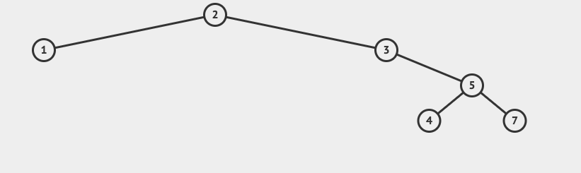
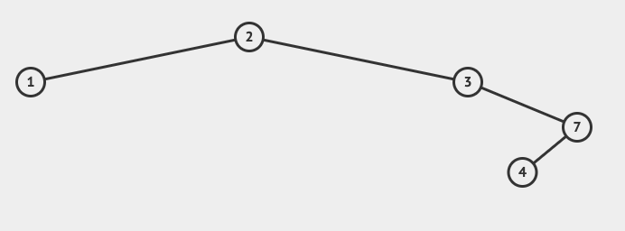
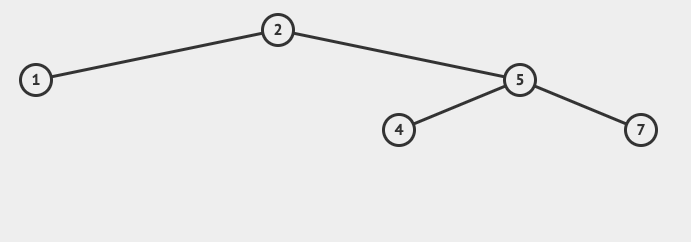

### 二叉搜索树(Binary Search Tree)
**BST的特点:**
- 若它的`左子树`不空，则`左子树`上所有节点的值均小于它的根节点的值
- 若它的`右子树`不空，则`右子树`上所有节点的值均大于它的根节点的值
- 它的左右子树也分别为**二叉排序树**

Insert 2,3,1,5,4,7的结果,

#### 1、删除
删除节点分为三种情况:
**1.要删的节点有两个孩子：**
找到左子树中的最大值或者右子树中的最小值所对应的节点，记为node，并把node的值赋给要删除的节点del,然后删除node

例如删除节点`5`之后:

**2.要删的节点有一个孩子:**
  (1)若`左子树`为空，则让该节点父节点指向其右节点；
  (2)若`右子树`为空，则让该节点父节点指向其左节点。

例如删除节点`3`之后:

**3.要删的节点没有孩子:**
那么该节点为叶子节点，则让该节点的父节点指向其变为NULL，然后释放节点。
