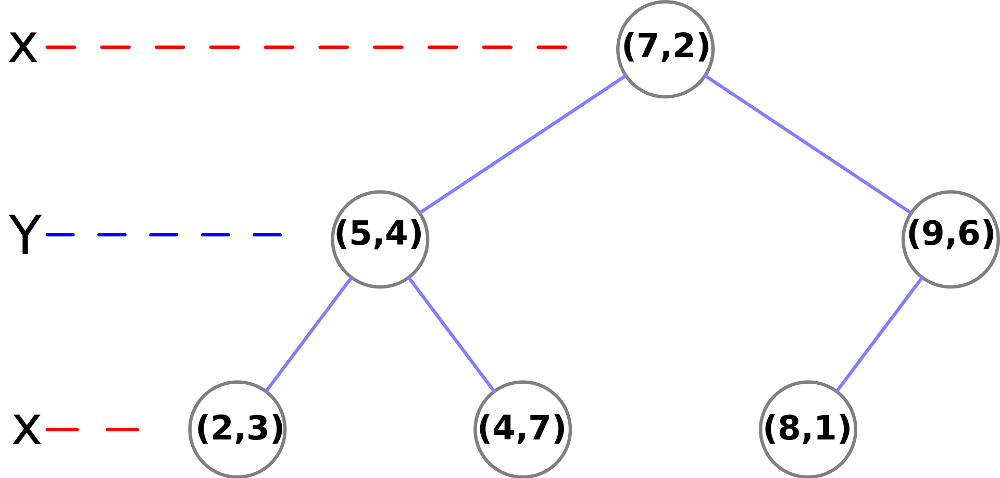

### kd-tree

[KD-Tree 算法](https://blog.csdn.net/ye1215172385/article/details/80214776)
[机器学习——详解 KD-Tree 原理](https://www.cnblogs.com/techflow/p/12658354.html)

[KD Tree 的原理及 Python 实现](https://zhuanlan.zhihu.com/p/45346117?utm_source=wechat_session&utm_medium=social&utm_oi=984539009145569280)

[](https://github.com/ubilabs/kd-tree-javascript)


输入 6 个点坐标:

```js
(2,3), (5,4), (9,6), (4,7), (8,1), (7,2)。
```



#### 1、Kd-Tree 的构建

- 选取方差最大的特征作为分割特征；
- 选择该特征的中位数作为分割点；
- 将数据集中该特征小于中位数的传递给根节点的左儿子，大于中位数的传递给根节点的右儿子；
- 递归执行，直到所有数据都被建立到 KD Tree 的节点上为止。

**1)特征选取:**
因为方差大，数据相对“分散”，选取该特征来对数据集进行分割，数据散得更“开”一些。

**2)分割点选择:**
因为借鉴了 BST，选取中位数，让左子树和右子树的数据数量一致，便于二分查找。

#### 2、Kd-Tree 的最近邻查找

1. 从根节点开始，根据目标在分割特征中是否小于或大于当前节点，向左或向右移动。
2. 一旦算法到达叶节点，它就将节点点保存为“当前最佳”。
3. 回溯，即从叶节点再返回到根节点
4. 如果当前节点比当前最佳节点更接近，那么它就成为当前最好的。
5. 如果目标距离当前节点的父节点所在的将数据集分割为两份的超平面的距离更接近，说明当前节点的兄弟节点所在的子树有可能包含更近的点。因此需要对这个兄弟节点递归执行 1-4 步。
